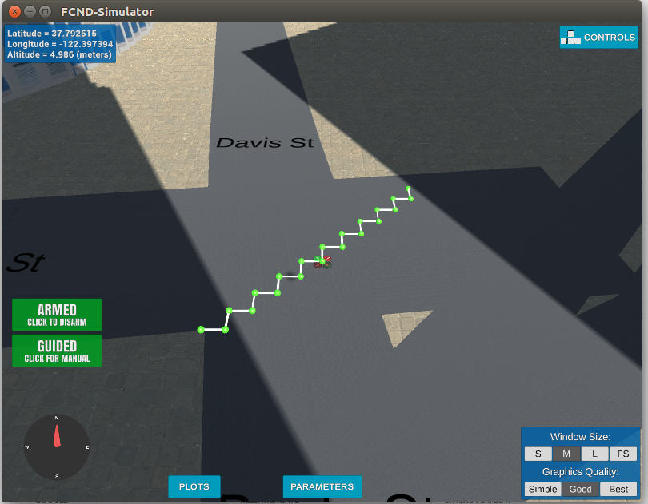
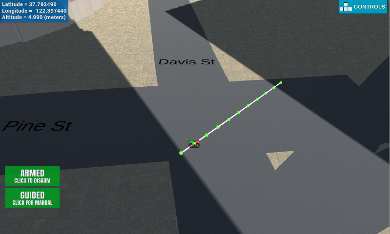
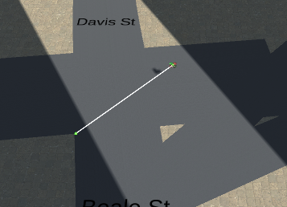

## Project: 3D Motion Planning


---

### Explaination of the Starter Code


#### 1. Explain the functionality of what's provided in `motion_planning.py` and `planning_utils.py`
These scripts contain a basic planning implementation that includes commands to fly a quadcopter in a path. `motion_planning.py` is the modified version of `backyard_flyer.py`. `backyard_flyer.py` consists of commands to make quadcopter start, fly to the sets of waypoints as defined by the user and land.

But in `motion_planning.py`, we just define the initial position `grid_start`, `TARGET_ALTITUDE` and target position `grid_goal` and the program itself plans the path and fly to the target position.

`planning_utils.py` contains functions to create grids of configuration space and A-star algorithm for planning the path.

The planner performs path planning in the method plan_path$$) with following steps:
1. Read global home, global position and local position

    ``
     print('global_home{0},position{1},local_position{2}'.format(self.global_home,self.global_position,
     self.local_position))
    ``

2. Read the obastacles data from `colliders.csv`.

    ``
     data = np.loadtxt('colliders.csv', delimiter=',', dtype='Float64', skiprows=2)
    ``

3. Create grid for 2D representation of configuration space using `create_grid` from `planning_utils.py`.

    ``
    grid, north_offset, east_offset =create_grid(data,TARGET_ALTITUDE, SAFETY_DISTANCE)
    ``

4. Define starting position and target position on the grid

    ``
    grid_start = (-north_offset, -east_offset)
    grid_goal = (-north_offset + 10, -east_offset + 10)
    ``

5. Use `a_star` algorithm from `planning_utils.py` to find path from start to target position.

    ``
    path, _ = a_star(grid, heuristic, grid_start, grid_goal)
    ``
6. Convert the planned path into waypoints, and send the waypoints to simulator

    ``
    waypoints = [[p[0] + north_offset, p[1] + east_offset, TARGET_ALTITUDE, 0] for p in path]
    self.waypoints = waypoints
    self.send_waypoints()
    ``



### Implementing Your Path Planning Algorithm

#### 1. Set your global home position
The starter code assumed the home position where the drone first initializes, but in reality the drone should to be able to start planning from anywhere.

To set the global home position, we read the first line of the `colliders.csv` file and extract latitude and longitude as floating point values and use ``self.set_global_position()`` method to set global home.

# Explain briefly how you accomplished this in your code.

The first line of the csv file describes the global home position as `lat0 37.792480`, `lon0 -122.397450`. I extracted the values of `lat0` and `lon0` from the csv file, and set it to home position with
```
l=open('colliders.csv','r').readline()
l2=l.split(',')
l3=l2[0].split()
l4=l2[1].split()
lat0=float(l3[1])
lon0=float(l4[1])

self.set_home_position(lon0,lat0,TARGET_ALTITUDE)
```

#### 2. Set your current local position
The starter code assumed the drone takes off from map center, but you'll need to be able to takeoff from anywhere.

To set the our current local position, we retrieve our current global position in geodetic coordinates and the use function `glocal_to_local()` to convert to local position.

```
current_local_position = global_to_local (self.global_position, self.global_home)
```

#### 3. Set grid start position from local position
The starter code assumed the `start` point for planning to be map center. But we must set the start position from grid start position to our current local position.

```
ns=current_local_position[0]
es=current_local_position[1]
grid_start = (int(np.ceil(ns-north_offset)), int(np.ceil(es-east_offset)))
```

#### 4. Set grid goal position from geodetic coords
We should be able to choose any (lat, lon) within the map and have it rendered to a goal location on the grid. The starter code assumed goal position to be located at 10m north and 10m east of map center. So, to set this at arbitrary location on the grid given any geodetic coordinates (latitude, longitude), we add the following in our script:
```
goal_lon=-122.39673
goal_lat=37.797391
global_goal=[goal_lon,goal_lat,0]
local_goal=global_to_local(global_goal,self.global_home)

goal_north=local_goal[0]
goal_east=local_goal[1]

grid_goal = (int(np.ceil(-north_offset + goal_north)),int(np.ceil( -east_offset + goal_east)))
if grid[grid_goal[0]][grid_goal[1]]>0:
    print("Error: Goal is in collosion")
    print('Reseting goal to start location\n')
    grid_goal=grid_start
```


#### 5. Modify A* to include diagonal motion (or replace A* altogether)
The code was modified in planning_utils() to update the A* implementation to include diagonal motions on the grid that have a cost of sqrt(2).

Add diagonal movement in Action class.

```
    NORTH_WEST = (-1, -1, np.sqrt(2))
    NORTH_EAST = (-1, 1, np.sqrt(2))
    SOUTH_WEST = (1, -1, np.sqrt(2))
    SOUTH_EAST = (1, 1, np.sqrt(2))
```

Check obstacles for diagonal motions.

```
    if (x - 1 < 0 or y - 1 < 0) or grid[x - 1, y - 1] == 1:
        valid_actions.remove(Action.NORTH_WEST)
    if (x - 1 < 0 or y + 1 > m) or grid[x - 1, y + 1] == 1:
        valid_actions.remove(Action.NORTH_EAST)
    if (x + 1 > n or y - 1 < 0) or grid[x + 1, y - 1] == 1:
        valid_actions.remove(Action.SOUTH_WEST)
    if (x + 1 > n or y + 1 > m) or grid[x + 1, y + 1] == 1:
        valid_actions.remove(Action.SOUTH_EAST)
```



#### 6. Cull waypoints
Collinearity test was used to prune the path of unnecessary waypoints. The following code was added in `planning_utils.py` for pruning.

    def prune_path(path, epsilon=1e-6):

    def point(p):
        return np.array([p[0], p[1], 1.]).reshape(1, -1)

    def collinearity_check(p1, p2, p3):
        m = np.concatenate((p1, p2, p3), 0)
        det = np.linalg.det(m)
        return abs(det) < epsilon

    pruned_path = [p for p in path]
    i = 0
    while i < len(pruned_path) - 2:
        p1 = point(pruned_path[i])
        p2 = point(pruned_path[i+1])
        p3 = point(pruned_path[i+2])
        collinear = collinearity_check(p1, p2, p3)
        if collinear:
            pruned_path.remove(pruned_path[i+1])
        else:
            i += 1
    return pruned_path

And in `motion_planning.py`, following code was added:


    pruned_path = prune_path(path)




### Execute the flight
#### 1. Does it work?
It works!
